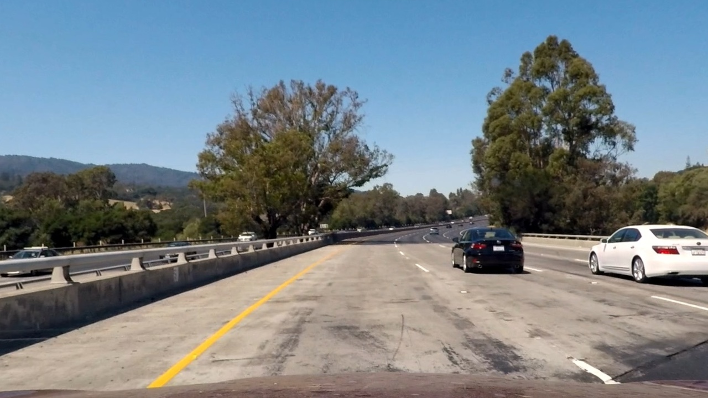

## Writeup Template

---

**Advanced Lane Finding Project**

The goals / steps of this project are the following:

* Compute the camera calibration matrix and distortion coefficients given a set of chessboard images.
* Apply a distortion correction to raw images.
* Use color transforms, gradients, etc., to create a thresholded binary image.
* Apply a perspective transform to rectify binary image ("birds-eye view").
* Detect lane pixels and fit to find the lane boundary.
* Determine the curvature of the lane and vehicle position with respect to center.
* Warp the detected lane boundaries back onto the original image.
* Output visual display of the lane boundaries and numerical estimation of lane curvature and vehicle position.

[//]: # (Image References)

[undistorted]: ./output_images/test1.png/01_undistorted.jpg "Undistorted"
[transform]: ./output_images/test1.png/02_perspective_transform.jpg "Road Transformed"
[lane_selector]: ./output_images/test1.png/03_lane_selector.jpg "Binary Example"
[image5]: ./output_images/test1.png/04_plotted_lines.jpg "Fit Visual"
[image6]: ./output_images/test1.png/05_pipeline_result.jpg "Pipeline Output"
[video1]: ./output_videos/project_video.mp4 "Video"

---

### Writeup / README

#### 1. Provide a Writeup / README that includes all the rubric points and how you addressed each one.  You can submit your writeup as markdown or pdf.  [Here](https://github.com/udacity/CarND-Advanced-Lane-Lines/blob/master/writeup_template.md) is a template writeup for this project you can use as a guide and a starting point.

You're reading it!

### Camera Calibration

#### 1. Briefly state how you computed the camera matrix and distortion coefficients. Provide an example of a distortion corrected calibration image.

The code for this step is contained and labelled in the first section of the Main IPython notebook (located at `./Main.ipynb`). I also wrote a function `calibrate` to handle calibration, located in `./src/calibrate.py`.

The calibrate function generates object points (i.e. (0, 0, 0), (1, 0, 0), ... (0, 1, 0), (1, 1, 0), ...) corresponding to intersections on each of the the given chessboards. It then tries to detect those corners in pixel space in each image, then passes off the hard work to OpenCV2 to build the correspondance between the real world and how the camera perceives the world. Finally, the calibrate function returns, among other things, a function to call on images from this camera in order to apply the calibration.

Just for fun, I had the images saved with the lines connecting the found chessboard corners.

Uncalibrated:

Calibrated (watch the lens correction):

### Pipeline (single images)

The images demonstrating my pipeline are furtherdown in my Main notebook.

#### 0. Show an example of an original image.

#### 1. Provide an example of a distortion-corrected image.

(Applied this using the function returned by my calibrate function.)

#### 2. Describe how (and identify where in your code) you used color transforms, gradients or other methods to create a thresholded binary image.  Provide an example of a binary image result.

This section of the main python notebook is clearly labelled. Note that I do this step after the perspective transform.

This part was frustrating and full of trial and error. I ended up creating several tools to help with this step (useful for prototyping and avoiding this awkward syntax, but memory-inefficient), located in `./src/image_mappings.py` and `./src/thresholding.py`.

I used a combination of color and gradient thresholds to generate a binary image.  Here's an example of my output for this step.

I left several fundamental thresholding functions ('selectors') laying around in the notebook so I could fiddle with them later, should things go poorly in the video section. You can see outputs of those in the notebook itself or in the HTML artifact I generated.

#### 3. Describe how (and identify where in your code) you performed a perspective transform and provide an example of a transformed image.

My perspective transform function is defined in the main notebook before the selectors/thresholds. Also, some reusable helper code can be found in `./src/perspective.py`.

A couple sample images are provided in the notebook, but here is another sample image of the results:

I have confidence in my mapping because of this example, featuring straight lines:

#### 4. Describe how (and identify where in your code) you identified lane-line pixels and fit their positions with a polynomial?

The section where I did this is clearly identified in my notebook. It comes after the lane selection/thresholding section. A lot of this code was written to not care about how many lanes there were (because that super challenge video had me paranoid).

Just as in the course, I utilize a sliding window approach. My hyperparameters are slightly tweaked (didn't seem to help much). For video solutions, I did not implement a stateful solution to reduce the searching required.

Here's a sample quadratically-fitted binary image (in red):

As you can see, my lane selector function is rather selective, so a lot of data appears to be missing in this example. This sometimes leads to slightly-off polynomials, much like the right lane in the image above.

#### 5. Describe how (and identify where in your code) you calculated the radius of curvature of the lane and the position of the vehicle with respect to center.

I used the formula provided in the course to calculate offset and curvature, both of which I made into functions and stored below yet nearby the polynomial-fitting and line detection code.

The curvature value actually displayed is the average of the two curvatures given.

#### 6. Provide an example image of your result plotted back down onto the road such that the lane area is identified clearly.

This is using the full_pipeline function with the state flag set to False. Meaning, no state is preserved from previous pipeline runs (useful for video).

---

### Pipeline (video)

#### 1. Provide a link to your final video output.  Your pipeline should perform reasonably well on the entire project video (wobbly lines are ok but no catastrophic failures that would cause the car to drive off the road!).

Here's a [link to my video result](./output_videos/project_video.mp4)

---

### Discussion

#### 1. Briefly discuss any problems / issues you faced in your implementation of this project.  Where will your pipeline likely fail?  What could you do to make it more robust?

The major weakness in this implementation is the thresholding part. It is coded against a limited set of samples with particular conditions assumed (i.e. color detectors may fail when ground is wet, or we go off the road), plus I got frustrated and eventually strived to spend as little time and sanity on this part as possible.

I believe this weakness is inherent to the computer vision approach to this problem, or almost any problem. Any sort of number fiddling is best left to a Machine Learning type task, which can code against MANY more examples and gain better results quicker than I can by hand. Plus, bizzarely enough, the code might look cleaner (thanks Keras!)

One trick I attempted in order to boost the robustness of my pipeline was to introduce limited statefulness to help filter out bad fits and average out changes in fit in a video. This, plus sanity checks, improved robustness considerably, but still cannot account fully for the weakness of the `lane_selector` code.
